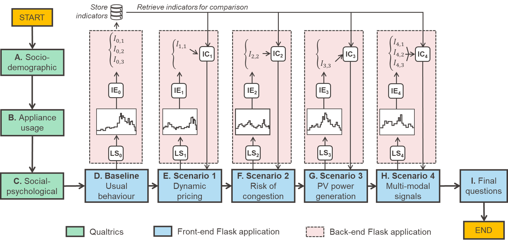

# MoMeEnT-Project

Welcome to the MoMeEnT-Project repository! This project is part of the MoMeEnT initiative from the HERUS lab at EPFL. It contains the web interface implementation for the MoMeEnT system, designed for specific tasks and functionality. This README provides essential information to help you get started with the project.

## Table of Contents
1. [Installation](#installation)
   - [Creating a Virtual Environment](#creating-a-virtual-environment)
   - [Installing the Requirements](#installing-the-requirements)
2. [Running the Application](#running-the-application)
3. [Browser Recommendations](#browser-recommendations)
4. [How to Cite This Work](#how-to-cite-this-work)
5. [License](#license)

# Overview of simulation-driven adaptive survey

This is a simplified version. The original version used in the paper XXX, was coupled with a Qualtrics survey platform so that .. In figure we report the original structure. 



To let you test this approach on your computer we implemented the following simplified version. This is fully implemented in a simplified way using Flask. 

## Installation

Before running the application, we recommend setting up a virtual environment to manage project dependencies and avoid conflicts with other Python projects on your system.

### Creating a Virtual Environment

A virtual environment allows you to isolate the project dependencies from your global Python environment. Here’s how to set it up:

1. **Install `virtualenv`** (if you don’t have it already):

   If you’re using `pip`, you can install it via the following command:

   ```bash
   pip install virtualenv
   ```

2. **Create a new virtual environment** in your project directory:

   In your terminal, navigate to the directory where you want to clone the repository, and run:

   ```bash
   virtualenv venv
   ```

   This will create a new virtual environment in a folder named `venv`.

3. **Activate the virtual environment**:

   - On **Windows**:

     ```bash
     .env\Scriptsctivate
     ```

   - On **macOS/Linux**:

     ```bash
     source venv/bin/activate
     ```

   After activation, you should see `(venv)` in the terminal prompt, indicating that the virtual environment is active.

### Installing the Requirements

With your virtual environment active, you can now install the project’s dependencies.

1. **Clone the repository**:

   First, clone the project to your local machine by running the following command:

   ```bash
   git clone git@github.com:ghalifaten/MoMeEnT-Project.git
   ```

2. **Navigate to the project directory**:

   Change to the project directory:

   ```bash
   cd MoMeEnT-Project
   ```

3. **Install the required Python packages**:

   Use the `requirements.txt` file to install the necessary dependencies:

   ```bash
   pip install -r requirements.txt
   ```

   This will install all the required Python libraries that the project depends on.

## Running the Application

Once the dependencies are installed, you can run the Flask application:

1. **Start the Flask server**:

   Run the following command to launch the application:

   ```bash
   python3 web_interface/src/main.py
   ```

   After running this command, you should see output similar to the following in your terminal:

   ```
   * Serving Flask app 'main'
   * Debug mode: on
   WARNING: This is a development server. Do not use it in a production deployment. Use a production WSGI server instead.
   * Running on http://127.0.0.1:5000
   Press CTRL+C to quit
   * Restarting with watchdog (inotify)
   * Debugger is active!
   * Debugger PIN: 971-457-079
   ```

   The application will be running locally at `http://127.0.0.1:5000`.

## Browser Recommendations

You can access the app by clicking on the link provided in the terminal output (`http://127.0.0.1:5000`) or by copying and pasting it into your browser. 

For the best user experience, we recommend using **Firefox**. Some features might not work correctly in other browsers, so please ensure you're using Firefox when testing or interacting with the application. 
TODO: explain that it is compatible mainly with computer displays and that everything runs locally. In the original version, the model was running on AWS servers etc...

## How to Cite This Work

If you use the MoMeEnT-Project in your research or academic work, please cite it using the following reference:

```
[Author(s)], "MoMeEnT-Project: Web Interface for MoMeEnT System", HERUS Lab, EPFL, Year.
```

TODO: add citation and emial to contact us

## License

This project is licensed under the MIT License - see the [LICENSE](LICENSE) file for details.

---

Feel free to reach out with any questions or issues you encounter. 
TODO: add licence
