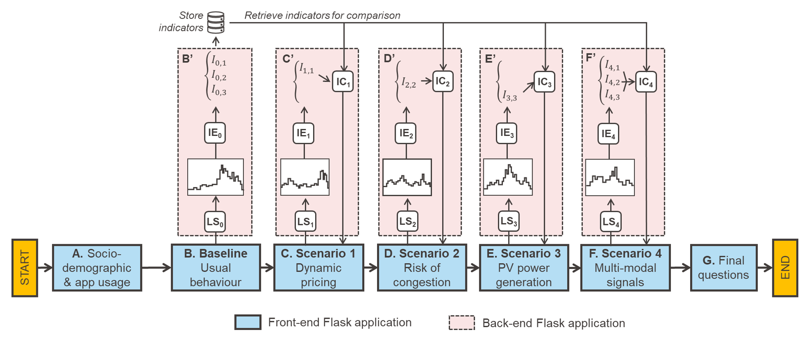
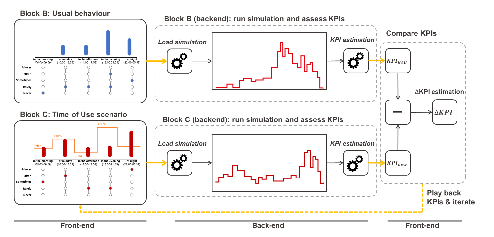

# MoMeEnT Adaptive Survey 

Welcome to the **momeent-adaptive-survey** repository! This repository hosts the implementation of a web-based interface for an innovative, model-driven adaptive survey approach.  

Below, you will find all the essential information to get started with the tool and explore its functionalities.

---

## Table of Contents
1. [Overview](#overview)
2. [Installation](#installation)
   - [Creating a Virtual Environment](#creating-a-virtual-environment)
   - [Installing the Requirements](#installing-the-requirements)
3. [Running the Application](#running-the-application)
4. [Browser and Device Recommendations](#browser-and-device-recommendations)
5. [How to Cite This Work](#how-to-cite-this-work)
6. [Acknowledgments](#acknowledgments)
7. [License](#license)
8. [Contact](#contact)

---

## Overview

### What is a model-driven adaptive survey?
A model-driven adaptive survey integrates dynamic feedback loops between survey data and simulation models. Through an iterative process, respondents provide data about their characteristics and behavior (e.g., sociodemographics, appliance usage), which parametrizes and runs the model. The model generates personalized indicator scores (e.g., energy consumption patterns). These scores are shared in near real-time, helping participants understand the impact of their choices and encouraging informed adjustments.

### How does it work?
Model-driven adaptive surveys can be implemented in various ways, tailored to different purposes. This implementation investigates user preferences for load-shifting in energy consumption. The survey flow and functionalities are illustrated below:



The procedure is as follows:

1. **Block A**: Respondents answer introductory questions about their sociodemographic characteristics (e.g., household size, type) and appliance usage behavior (e.g., frequency of dishwasher use).
2. **Block B**: Respondents indicate typical washing times for appliances using sliders.

   <p align="center">
     
   </p>

3. **Block B' (Backend)**: The tool estimates key performance indicators (KPIs) like yearly appliance costs, energy usage during peak hours, and the share of energy from renewable sources. A simplified version of [demod](https://github.com/epfl-herus/demod), a Python library for household energy demand simulation, is used for these calculations.

   <p align="center">
     
   </p>

4. **Block C**: Respondents are presented with a scenario involving time-of-use tariffs. They adjust their washing times in response to fluctuating electricity prices.

   <p align="center">
     
   </p>

5. **Block C' (Backend)**: KPIs are recalculated and compared to the baseline. The results are shared with respondents, allowing them to iterate and find their preferred configurations.

   

6. **Blocks D-F**: Additional scenarios are introduced, such as grid congestion or increasing renewable energy usage. Respondents adjust behaviors iteratively to explore trade-offs.

### Why use a model-driven adaptive survey?
Traditional surveys with fixed-choice questions often fail to capture the complexities of user behavior, especially in energy consumption and demand-side flexibility. Model-driven adaptive surveys address this by integrating energy demand models, enabling respondents to make complex decisions in a tailored and interactive way.

### Current Version
The **momeent-adaptive-survey** is a simplified version of the original survey described in *[Reference Paper]*. It is implemented as a Flask-based application, available in English, and designed for local testing.

Unlike the original version, which utilized AWS servers for backend processing, this simplified version operates entirely on your local machine. As a result, you may experience slight delays when loading results or switching pages. Thank you for your patience! 😊

---

## Installation

Follow these steps to set up the project. We recommend using a virtual environment to manage dependencies.

### Creating a Virtual Environment

1. **Install `virtualenv`**:
   ```bash
   pip install virtualenv
   ```

2. **Create a virtual environment**:
   ```bash
   virtualenv venv_name
   ```

3. **Activate the virtual environment**:
   - **Windows**:
     ```bash
     venv_name\Scripts\activate
     ```
   - **macOS/Linux**:
     ```bash
     source venv_name/bin/activate
     ```

   After activation, `(venv_name)` should appear in your terminal prompt.

### Installing the Requirements

1. **Clone the repository**:
   ```bash
   git clone https://github.com/BarsantiMatteo/momeent-adaptive-survey.git
   ```

2. **Navigate to the project directory**:
   ```bash
   cd momeent-adaptive-survey
   ```

3. **Install dependencies**:
   ```bash
   pip install -r requirements.txt
   ```

---

## Running the Application

1. **Start the Flask server**:
   ```bash
   python web_interface/src/main.py
   ```

   You should see output similar to this:
   ```
   * Serving Flask app 'main'
   * Debug mode: on
   WARNING: This is a development server. Do not use it in a production deployment.
   * Running on http://127.0.0.1:5000
   Press CTRL+C to quit
   * Debugger is active!
   ```

2. **Access the application**:
   Open your browser and navigate to `http://127.0.0.1:5000` to use the app locally.

---

## Browser and Device Recommendations

For the best experience:
- Use **Firefox**. Some features may not work as intended on other browsers.
- Use a computer (PC or notebook) display. Mobile devices are not supported.

Note: The original version used AWS servers for the backend model. This simplified version runs entirely on your local machine.

---

## How to Cite This Work

If you use the **momeent-adaptive-survey** in your research, please cite it as follows:

```
[Author(s)], "MoMeEnT-Project: Web Interface for MoMeEnT System", HERUS Lab, EPFL, Year.
```

---

## Acknowledgments

This tool was developed as part of the MoMeEnT project, a collaboration between École Polytechnique Fédérale de Lausanne (EPFL) and the University of Oldenburg. The project was funded by the Swiss National Science Foundation (SNSF project number: 182878) and the Deutsche Forschungsgemeinschaft (DFG project number: LE 3131/8-1).

---

## License

This project is licensed under the MIT License. See the [LICENSE](LICENSE) file for details.

---

## Contact

For questions or issues, feel free to reach out at [your_email@example.com].