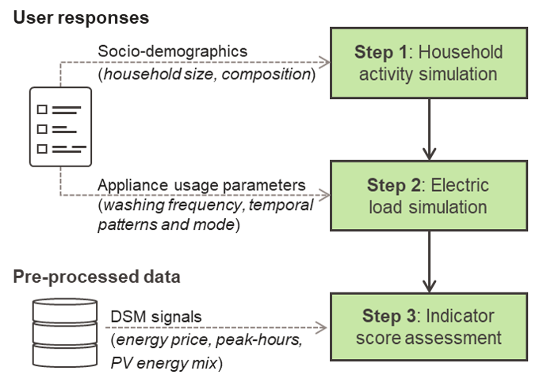

# MoMeEnT-Project

Welcome to the **MoMeEnT-Project** repository! This project is part of the MoMeEnT initiative from the HERUS lab at EPFL. It contains the web interface implementation for the MoMeEnT system, designed for specific tasks and functionality. This README provides essential information to help you get started.

---

## Table of Contents
1. [Overview](#overview)
2. [Installation](#installation)
   - [Creating a Virtual Environment](#creating-a-virtual-environment)
   - [Installing the Requirements](#installing-the-requirements)
3. [Running the Application](#running-the-application)
4. [Browser Recommendations](#browser-recommendations)
5. [How to Cite This Work](#how-to-cite-this-work)
6. [License](#license)

---

## Overview

The **MoMeEnT-Project** is a simplified version of the original system described in the paper *[XXX]*. The original implementation was integrated with the Qualtrics survey platform. Below, the overall survey structure is illustrated:


The figure highlights the original structure. A detailed view of the procedure for calculating and comparing Key Performance Indicators (KPIs) used as feedback for respondents is shown below:



This repository provides a simplified version of the system implemented entirely in Python using the Flask framework. The application allows users to test the approach locally.

---

## Installation

Follow these steps to set up the project on your system. It is highly recommended to use a virtual environment to manage dependencies.

### Creating a Virtual Environment

1. **Install `virtualenv`** (if not already installed):
   ```bash
   pip install virtualenv
   ```

2. **Create a virtual environment** in your project directory:
   ```bash
   virtualenv venv
   ```

3. **Activate the virtual environment**:
   - **Windows**:
     ```bash
     venv\Scripts\activate
     ```
   - **macOS/Linux**:
     ```bash
     source venv/bin/activate
     ```

   After activation, `(venv)` should appear in your terminal prompt.

### Installing the Requirements

1. **Clone the repository**:
   ```bash
   git clone git@github.com:ghalifaten/MoMeEnT-Project.git
   ```

2. **Navigate to the project directory**:
   ```bash
   cd MoMeEnT-Project
   ```

3. **Install dependencies**:
   ```bash
   pip install -r requirements.txt
   ```

This will install all the necessary Python libraries listed in the `requirements.txt` file.

---

## Running the Application

1. **Start the Flask server**:
   ```bash
   python3 web_interface/src/main.py
   ```

   You should see output like this:
   ```
   * Serving Flask app 'main'
   * Debug mode: on
   WARNING: This is a development server. Do not use it in a production deployment.
   * Running on http://127.0.0.1:5000
   Press CTRL+C to quit
   * Debugger is active!
   ```

2. **Access the application**:
   Open your browser and navigate to `http://127.0.0.1:5000` to use the app locally.

---

## Browser Recommendations

For the best experience, please use **Firefox**. Some features might not function as intended on other browsers. Note that this application is optimized for use on computer displays, and everything runs locally on your machine. 

In the original version, the backend model was deployed on AWS servers, but this simplified version is fully self-contained.

---

## How to Cite This Work

If you use the **MoMeEnT-Project** in your research, please cite it as follows:

```
[Author(s)], "MoMeEnT-Project: Web Interface for MoMeEnT System", HERUS Lab, EPFL, Year.
```

For additional citation details, contact us at [your_email@example.com].

---

## License

This project is licensed under the MIT License. See the [LICENSE](LICENSE) file for details.

---

Feel free to reach out with any questions or issues you encounter.
